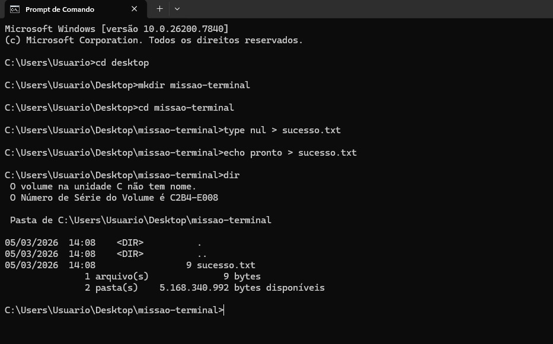

# README.md
# ⚡ Meus Comandos Favoritos
Aqui estão os comandos que mais utilizei na aula de Terminal:

- `cd`: Para navegar entre pastas.
- `dir`: Para listar arquivos.
- 

## 📸 Evidência de Execução

